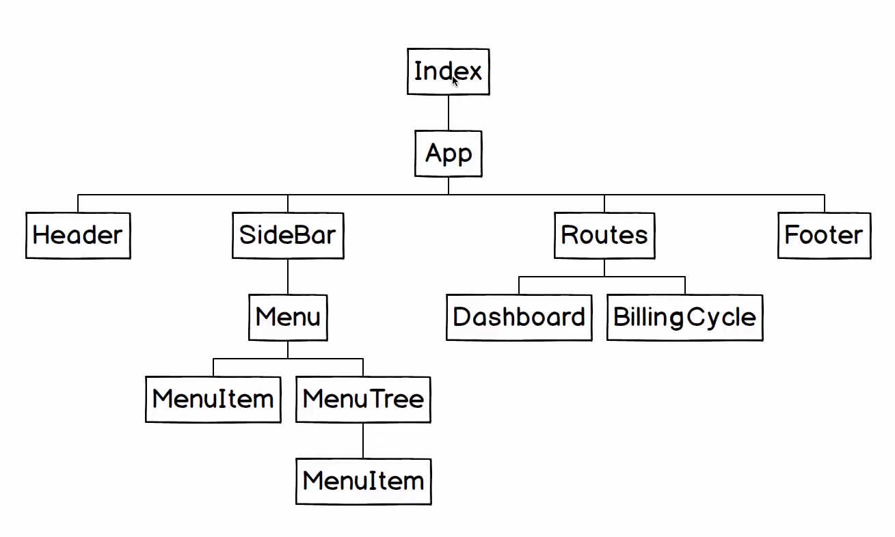

# my-money-app

Site para gerenciamento de finanças.

---

## Feito em:

- Back-end:
    - Node.JS
- Front-end:
    - React.JS

---

## Como Rodar o projeto:

1) Mongo DB
```bash
sudo mongod
```

2) Back-end
```bash
cd backend
npm run production
```

3) Front-end
```bash
cd frontend
npm run dev
```

4) Entrar na URL:
   [http://localhost:8080](http://localhost:8080)

---

## Estrutura da Aplicação



---

## Curso da Udemy:

[Curso React + Redux: Fundamentos e 2 Apps do Absoluto ZERO!](https://www.udemy.com/course/react-redux-pt/)

Ministrado por:
- [@leonardomleitao](https://github.com/leonardomleitao)
- [@cod3rcursos](https://github.com/cod3rcursos)

Repositório do Projeto: [link](https://github.com/cod3rcursos/curso-react-redux)
